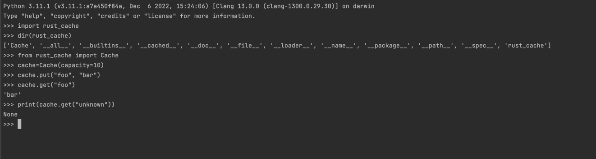

# Rust Cache


Rust Cache is a simple cache implementation written in Rust that can be used in Python.


## Usage


### To use Rust Cache, follow these steps:

1.Create a virtual environment by running the following commands:
  ```shell
  python3 -m venv .env
  source .env/bin/activate
  pip install maturin>=0.14.15
  ```

2.Build Rust Cache with Maturin by running:
  ```shell
  maturin build
  ```

  - To build for Silicon Chips, use:
    ```shell
    maturin build --target=x86_64-apple-darwin
    ```

3.Install the .whl package by running:
  ```shell
  pip install target/wheels/*whl --force-reinstall
  ```


4.Test Rust Cache by running the following command:
  ```shell
  cargo test
  ```

Clean up target file with ``cargo clean`` command

5.Clean up the target file by running:
  ```shell
  cargo clean
  ```


After following these steps, you can test the package by opening a Python interactive shell and running import rust_cache.
Like this :) 
